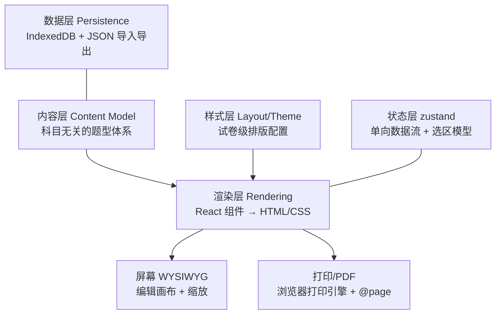

# QuiXam 长期架构设计

> 面向中学教师的低门槛试卷编排平台。当前阶段聚焦**高中**，格式对齐中国试卷惯例。
> 本文档是长期开发依据，随里程碑推进更新。

## 1. 产品定位与设计原则

**目标用户**：高中一线教师（后续扩展到初中）。特点：熟悉 Word 但苦于排版；对"软件"耐心有限；机器基本是 Windows + 校内打印。

**核心原则**：

1. **低门槛 = 默认即正确**。打开就是一张符合规范的试卷，改字就能用；所有排版决策（题号、序号、分值汇总、选项排列、分页）由系统自动完成，教师只管内容。
2. **模板驱动**。新建从模板开始（高考数学卷、英语四部分卷、空白卷…），而不是从空白页开始。
3. **所见即所得**。屏幕上看到的就是打印出来的，消除"导出后再调"的循环。
4. **本地优先（local-first）**。无注册、无网络也能用，数据存在浏览器本地；云端协作是后期增量，不是前提。

## 2. 分层架构

内容与样式严格分离，是支撑"全科目 + 排版自动化"的关键：同一份内容可以套用不同排版方案输出。



### 2.1 内容层（科目无关的题型体系）

**原子题型**（已定义于 `src/types.ts`）：

| 题型 | 覆盖场景 |
|------|----------|
| `single` 单选 | 全科选择题 |
| `multiple` 多选 | 新高考数学/物理多选 |
| `fill` 填空 | 数学填空、语文默写、英语语法填空 |
| `segmentation` 断句 | 作答说明与待断句文本分离；待断文本使用专用缩进和字距 |
| `calculation` 计算 | 数学、物理的推导计算；题后只预留空白 |
| `shortAnswer` 简答 | 历史、政治等整段作答；题后绘制横线 |
| `solution` 解答 | 生物、化学、地理、物理实验等多小问题 |
| `composition` 作文 | 语文方格或英语横线，独立于普通答题区 |

**结构容器**：`material` 材料题 = 共享材料（文段/图表/听力指令）+ 子题列表。它不是一种作答语义；英语完形/阅读理解、语文现代文/文言文阅读、理综题组、政史地材料分析题都用它组织共享内容，子题仍使用上表中的叶子题型，编号自动延续全卷。

`solution` 的每个 `parts[]` 小问同时支持两种答题位：题干中准确位置的 `______` 会渲染为不可断开的内嵌横线；`parts[].answerLines > 0` 时才在该小问结束后追加横线。二者可混用，系统不会给所有小问机械加线。

**富文本内联**：分两步走，避免过早引入复杂度。

- **v1（当前）**：纯文本 + 轻量标记。`$...$` 行内 KaTeX 公式；化学式用 mhchem 的 `\ce{...}`；单反引号表示行内代码；`\n` 换行；`______` 表示题干中的答题空位。实现简单、JSON 可读、教师从 Word 粘贴无损。
- **v2（M2）**：迁移到 TipTap 文档模型（依赖已预置），获得图片内联、加粗/下划线/着重号（语文需要）、上下标（化学 $\mathrm{CO_2}$ 也可先用 KaTeX 顶住）。迁移函数把 v1 纯文本无损升级为 TipTap JSON。

**题目元数据**：分值必填；难度、知识点标签（M3 题库复用的基础）作为可选字段预留。

**中国试卷格式规则内置在模型语义里**，而不是让教师配置：

- 大题序号"一、二、三"自动生成（存储时不含序号，`title: '选择题'`）；
- 题号全卷连续编号（跨大题累加），符合高考卷惯例；
- 大题标题自动附"（共 N 小题，M 分）"，分值由小题汇总，与声明满分自动校验；
- 选项 A–D 标号自动生成，按选项最长宽度自动排 4 列 / 2 列 / 1 列（高考卷标准排法）；
- 卷头：学校/届别行 + 居中大标题 + 考试时间/满分行 + 注意事项框；
- 作答方式由题型语义直接决定，不使用全卷样式开关：`calculation` 留白，`shortAnswer` 画题后横线，`solution` 由每个小问的内嵌空位和问后横线决定，`composition` 使用自己的方格/横线设置。

### 2.2 样式层（试卷级排版配置）

`PaperLayout`（已定义）挂在试卷上，与内容解耦：

| 配置 | v1 | 后续 |
|------|----|------|
| 纸张 | A4 单栏 | A3/8K 两栏对折（M2）、答题卡（M4） |
| 正文字体 | 宋/楷/黑三档预设 | 试卷各区域字体细分（标题黑体、注意事项仿宋等，内置在预设中） |
| 字号 | 五号/小四/四号三档 | — |
| 行距 | 紧凑/标准/宽松三档 | — |
| 卷头 | 标准卷头 + 可选密封线（装订线 + 竖排"班级/姓名/考号"） | 答题卡（M4） |

#### 字体规范（中国试卷惯例，内置于渲染层）

试卷只用五种字体，且各有固定语义分工——**黑体做结构，宋体做内容，楷体做引用，Times 管西文数字，仿宋仅一处**：

| 试卷部位 | 字体 | 常用字号 |
|---|---|---|
| 密级/提示行（"绝密★启用前"） | 黑体或宋体加粗 | 五号 |
| 试卷主标题、科目名 | 黑体（出版规范为方正小标宋，Web 以黑体加粗近似） | 二号/小二 |
| 考试时间/满分行 | 宋体 | 五号 |
| "注意事项"标题 | 黑体 | 五号 |
| 注意事项正文 | 宋体（部分地区楷体） | 五号 |
| 大题标题（"一、选择题（本题共…）"） | 黑体 | 五号/小四 |
| 题干正文、选项 | 宋体 | 五号（校内 A4 卷常用小四） |
| 西文、数字 | Times New Roman | 随正文 |
| 数学公式 | Times 斜体（变量斜体、单位正体，KaTeX 默认行为） | 随正文 |
| 阅读材料/作文引语（语文卷） | 楷体 | 五号 |
| **古诗作者（朝代）行** | **仿宋 —— 仿宋在试卷中唯一的固定用途**（诗歌正文为楷体，作者行再降一层区分） | 五号/小五 |
| 注释、图表标注、出处 | 宋体 | 小五 |
| 密封线区（姓名/班级/考号） | 宋体或楷体 | 五号 |
| 参考答案【答案】【解析】标签 | 黑体 | 随正文 |

对应 CSS 字体栈（西文字体置于栈首，中文字体不含西文字形时自动回退，天然实现"中宋西 Times"混排）：

```css
--font-hei:  "SimHei", "Heiti SC", sans-serif;                      /* 结构 */
--font-song: "Times New Roman", "SimSun", "Songti SC", serif;       /* 内容 */
--font-kai:  "Times New Roman", "KaiTi", "Kaiti SC", serif;         /* 引用（M2 材料题） */
--font-fang: "Times New Roman", "FangSong", "STFangsong", serif;    /* 仅古诗作者行（M2） */
```

字体按部位自动套用，不暴露给教师选择；`PaperLayout.bodyFont` 的档位只影响题干正文。

**字体加载策略：系统字体栈，不加载 webfont。**理由：

1. 中国试卷字体惯例（正文宋体、标题黑体、西文 Times New Roman）恰好全是 Windows 内置字体（SimSun/SimHei/宋体黑体楷体），教师机器上 100% 可用；
2. 中文 webfont 动辄 5–20 MB，与"打开即用"冲突；
3. 打印走本机字体最可靠，不存在字体替换导致的版式抖动。

实现上用 CSS 变量驱动：`--paper-body-font`、`--paper-font-size`、`--paper-line-height` 由 `PaperLayout` 映射，渲染层只消费变量。字体栈示例：

```css
/* 宋体方案 */ font-family: "Times New Roman", "SimSun", "Songti SC", serif;
/* 西文优先落 Times，中文落宋体 —— 与人教版试卷排版一致 */
```

### 2.3 渲染层

**屏幕**：React 组件把 `Paper` 渲染成 HTML 试卷页，编辑画布即预览（点击题目选中 → 右栏属性面板编辑，画布实时更新）。缩放用 CSS `zoom`。

**打印/PDF：走浏览器打印引擎，不自研 PDF 生成。**这是本架构最重要的技术决策：

- 中文断行、标点悬挂、KaTeX 公式、图片缩放……浏览器排版引擎已经解决，`pdf-lib`/`jsPDF` 路线要全部重做且中文字体嵌入巨大；
- `@page { size: A4 | A3 landscape; margin: 0 }` 控制纸张，页边距由纸面自身的 padding 提供——**屏幕与打印共用同一组毫米几何**，这是"所见即所得"能成立的前提（若两边各用一套数值，断行点与分页点必然漂移）；

#### 预分页（不把分页交给浏览器）

早期实现靠 `break-inside: avoid` + CSS 多栏，屏幕上是一张无限长的纸、打印时才由浏览器切页；A3 两栏更是屏幕两根等高长柱、与打印的"N 页 × 2 栏"顺序对不上，且绝对定位的密封线无法逐页重复。现改为渲染层自己分页：

1. **摊平**：`buildGroups()` 把整卷变成线性的**分组—片段**序列。一道题是一个 _组_，组内是若干可独立测量的 _片段_：题目主体（题号/题干/附图/选项）、答题横线、空白答题区。大题标题、材料区、答案分组各自成组。
2. **测量**：离屏容器按**栏宽**渲染全部片段，每片包在 `display: flow-root` 的壳里（外边距不外溢，量到的高度即实际占位），`useLayoutEffect` 读 `offsetHeight` 与 `line-height`。容器与真实页面共用同一套排印类，量值才作数。
3. **分配**：`paginate()`（纯函数，有单元测试）把片段铺进"页 × 栏"。
4. **渲染**：每页是一个固定尺寸的 `<article class="paper-page">`，各自渲染密封线与"第 X 页 共 Y 页"页脚；打印时页间 `break-before: page`。被切开的片用 `overflow: hidden` + 负 `margin-top` 承接上一片。

**唯一的硬约束是绝不溢出。** 装不下就必须切分或换页，任何情况下内容都不能越过页边。为此片段按可切分程度分三类，按语义优先级降级处理：

| 片段 | 切法 |
|------|------|
| 空白答题区 | 任意高度切开（留白切在哪里都一样） |
| 答题横线 | 按整行切（行等高，切点必然落在行边界） |
| 语文/英语文章材料 | 连续正文流；当前栏能放下一行就按行边界续排，不为保住整个自然段而提前换栏 |
| 其余（题干、选项、诗歌…） | 先尝试整片换栏；空栏仍放不下才裁切，切点吸附到行高避免切穿字形 |

其余规则都是**可调偏好**，不是铁律：`keepQuestionTogether`（整题尽量不跨页）、`keepHeadingWithNext`（大题标题不落单）、`justifyPages`（自然撑满整页）挂在 `PaperLayout` 上供教师开关；即便开启，单题高于一整栏时仍会被切开——硬约束优先。

#### 竖排两端对齐与"灵活度"

每页实际排入的内容量不可能相同，底部必然有余量。与其一律留白，不如把余量摊回版面。摊给谁，由间隙的**灵活度**决定（`GAP_WEIGHT`）：

| 间隙 | 灵活度 |
|------|--------|
| 大题之间、卷头与正文之间 | 2 |
| 小题之间 | 1 |
| 大题标题与其首题之间、题内（题干↔选项↔答题区） | 0 |

**灵活度 0 是"最后才拉"，不是"不能拉"。** 分三档注水，前一档吃满各自上限后余量才落到下一档：正权重间隙按比例分 → 0 权重间隙 → 仍有余量就留在页底。每档都有单项上限，否则一页只有两道题时余量会全摊到一个间隙上，拉出十几厘米的空当，比留白更难看。

大题标题与其首题给 0，是因为标题在排印上向下绑定；把它和正文拉开，标题看起来像浮在半空。正文行距不参与撑页，始终保持教师选择的档位，避免同一份试卷不同页面的文字疏密不一致。

末页不参与对齐：卷子的最后一页本就该自然收尾。

> 后续做"压缩"类功能（例如把 10 页英语卷压进更少页数）时，同一套灵活度可以反向使用——按优先级依次压缩间隙与行距。

代价是每次编辑都要重新测量整卷（离屏容器会多渲染一份）；收益是屏幕所见的每一页就是打印出来的每一页，且密封线、页码、两栏顺序全部可控。图片异步解码会让首次测量偏小，故 `img` 的 load/error 会触发重新测量。
- 打印样式表隐藏所有编辑 UI，`zoom` 强制还原 100%；
- "导出 PDF" = `window.print()` → 教师选"另存为 PDF"或直接打印，零依赖。
- 两栏 8K 卷（M2）的分页兼容性是已知风险，见 §5。

### 2.4 数据层

- **IndexedDB**（`idb`，已定义于 `src/db.ts`）：`papers`（整卷 JSON）、`meta`（最近打开等）、`assets`（M2 图片 Blob，与试卷分表存避免 JSON 膨胀）。
- **自动保存**：编辑防抖 500ms 落库，顶栏显示保存状态；切卷/关页前强制 flush。
- **JSON 导入导出**是备份与教师间交换的格式：导出 = 下载 `.qxp.json`；当前为 `schemaVersion: 3`。导入会把 v2 的 `essay + answerStyle` 自动迁移为明确语义题型。**每次模型变更必须附迁移函数**，保证老文件永远能打开——这是 local-first 产品的生命线。
- **扫描识别采用直接结构化输出**：图片/PDF 直接送入用户配置的多模态 Responses API，并把 QuiXam 的导入 JSON Schema 作为严格输出格式；不落一份 OCR 文本或其他中间领域模型。前端只做边界校验，再补齐本地拥有的 `id`、时间戳与排版默认值。API Key 保存在当前站点的浏览器 `localStorage` 中，可由用户清空输入删除；不进入 IndexedDB、试卷、导出文件、URL 或日志。
- **远期**：可选后端同步（教研组共享、跨设备），架构上只需把"落库"抽象成 storage adapter，本地实现不变。

### 2.5 状态层

- zustand 单 store：当前试卷 + 试卷列表摘要 + 选区（`paper | section | question`）+ 视图状态（缩放、显示答案）。
- 所有修改经 store action，不可变更新 → 为 M2 的 **undo/redo**（patch 栈或 zundo）铺路。
- 内存里只保留当前一张卷，列表存摘要，切卷时按需从 IndexedDB 加载。

## 3. 目录规划

```
src/
  types.ts              # 领域模型（已建）
  db.ts                 # IndexedDB 封装（已建）
  store/paperStore.ts   # zustand store + 自动保存
  data/
    templates.ts        # 模板入口（空白 + 三科官方完整卷 + 七科结构模拟卷）
    paperFactory.ts     # 试卷/大题/题目构造器
    papers/             # 语数英公开原题；六门选择性考试 + 浙江技术选考原创模拟卷
  components/
    TopBar.tsx          # 试卷切换、新建、导入导出、打印
    OutlinePanel.tsx    # 左栏：结构树 + 快捷加题
    PaperCanvas.tsx     # 中栏：试卷画布（WYSIWYG）
    Inspector.tsx       # 右栏：属性面板（试卷/大题/题目上下文编辑）
    MathText.tsx        # $...$ 公式渲染（已建）
    ScanImportDialog.tsx # 图片/PDF + BYOK 结构化识别与导入预览
  utils/                # 编号、汇总、格式化、粘贴解析（已建，含 *.test.ts）
    paperRecognition.ts # 严格 JSON Schema、Responses API 请求、校验与运行时补全
  styles/print.css      # 打印样式（@page、break 规则）
```

**测试策略**：纯逻辑（编号、分值汇总、材料题展平、粘贴解析）用 vitest 做单元测试，是回归的第一道防线——这些函数决定题号是否连续、分值是否算对，出错会直接毁掉一张付印的卷子。UI 与打印排版不做自动化测试（浏览器排版结果难以断言），靠人工验收。

## 4. 演进路线

| 里程碑 | 内容 | 验收标准 |
|--------|------|----------|
| **M1 可用编辑器**（进行中） | 三栏工作台；题目/大题 CRUD 与排序；`$...$` 公式；自动编号/汇总/校验；字体字号行距方案；多试卷 + 自动保存；JSON 导入导出；A4 打印（教师版含参考答案） | 一位数学老师能在 30 分钟内排出一张能直接付印的模拟卷 |
| **M2 中国试卷格式深化**（主体完成） | 材料题；图片题；两栏 8K + 密封线；undo/redo；从 Word 粘贴清洗；六门选择性考试与浙江技术选考完整结构模拟卷；mhchem 化学式 | 语数英及七套省级科目模拟卷均可稳定分页；下一步完善富文本和答题卡 |
| **M3 题库与复用** | 题目入库、知识点/难度标签、检索、从库组卷、卷↔库双向更新 | 老师第二次组卷时间减半 |
| **M4 智能导入与协作**（智能导入首版完成） | **已完成首版：**图片/PDF + BYOK 多模态识别、严格 JSON Schema 直出、结构预览、新建/追加；**后续：**题图自动裁切、答题卡生成、账号与云同步、教研组共享库、AI 辅助命题/组卷（可选） | 当前可把无复杂题图的扫描卷导入并复核；后续以教研组为单位使用 |

## 5. 风险与对策

| 风险 | 对策 |
|------|------|
| 两栏打印分页在各浏览器行为不一 | **已解决**：不再依赖 CSS 分页与多栏，改为自实现预分页（见 §2.3），每页是显式的 DOM 容器、栏由代码分配 |
| 教师从 Word 粘贴带入垃圾格式 | v1 纯文本天然免疫；v2 TipTap 配 paste 清洗规则 |
| 浏览器清空站点数据导致丢卷 | 自动保存 + 定期"导出备份"提醒；后续 File System Access API 直存本地文件 |
| 模型演进破坏老文件 | JSON 带 `schemaVersion`，迁移函数链强制随模型变更提交 |
| 普通 KaTeX 不识别化学方程式（`\ce{}`） | **已解决**：加载 mhchem 扩展，题干、选项和答案共用同一渲染入口 |

## 6. 关键决策记录（ADR 摘要）

1. **浏览器打印而非自研 PDF** —— 中文排版质量与零体积优势压倒一切；代价是打印对话框体验，可接受。
2. **系统字体栈而非 webfont** —— 目标用户全 Windows，内置字体恰好就是试卷规范字体。
3. **纯文本 + `$...$` 先行，TipTap 后置** —— M1 求稳求快；TipTap 依赖已预置，迁移路径明确。
4. **local-first，无后端起步** —— 教师数据敏感度低但网络环境不定；IndexedDB + JSON 导出已满足单机场景，storage adapter 预留云化接口。
5. **格式规则内置于渲染，而非暴露为配置** —— 中国试卷格式是强惯例，自动化它才是"低门槛"；只暴露少量档位化选项（字体/字号/行距/纸张）。
6. **多模态模型直接输出试卷 Schema，不建 OCR 中间层** —— 中间文本与二次映射会重复丢失题型、材料归属和公式语义；严格结构化输出已经能约束最终契约。前端仍必须做不可信输入校验，运行时字段由本地生成。
